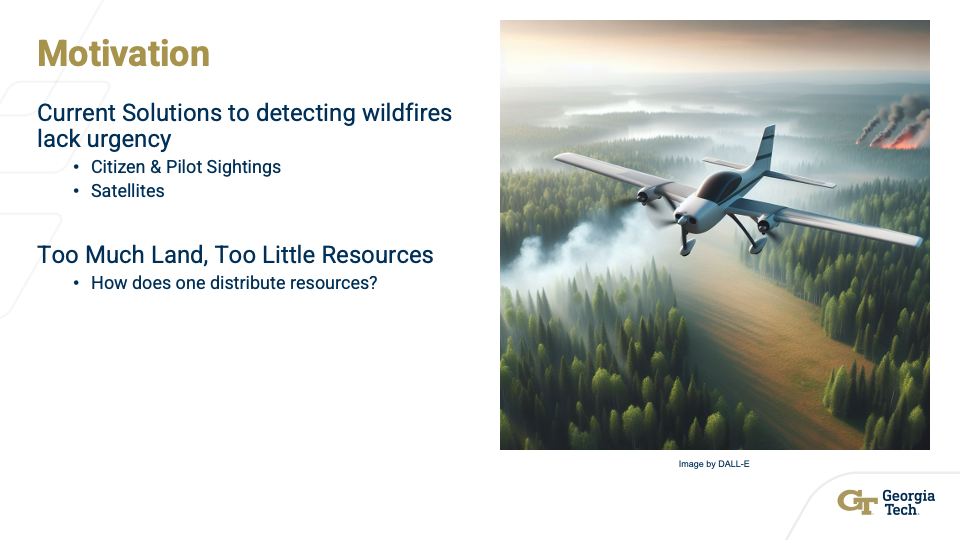
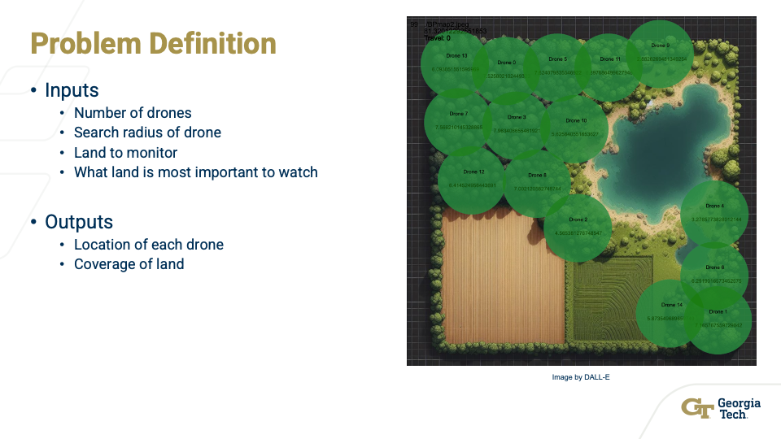
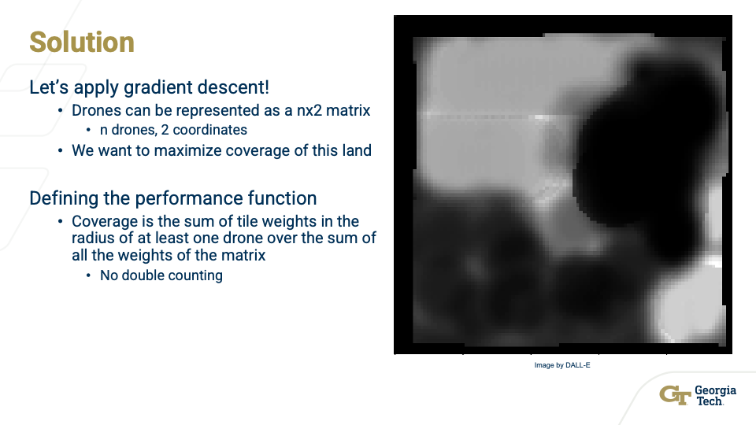
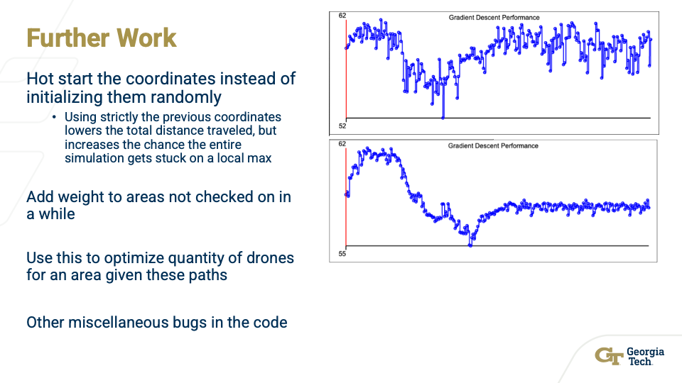

# Multi-Drone Coverage Optimization Using Gradient Descent

[](LICENSE)
[](https://www.java.com)
[]()

## Overview

An advanced gradient descent algorithm implementation for optimizing autonomous drone fleet coverage over dynamic probability maps. This system simulates multiple drones working collaboratively to maximize coverage of high-priority areas, with real-time visualization and interactive controls.

**Key Features:**
- Multi-threaded gradient descent optimization
- Hungarian algorithm for optimal drone-target assignment
- Interactive web-based visualization
- Teleportation heuristic for escaping local minima
- Applications in wildfire monitoring, search & rescue, and surveillance

---

## Project Presentation

<div align="center">


---



---



---



---

https://github.com/user-attachments/assets/93c54488-56eb-4e05-8b33-5e58c1ec4c52

---

https://github.com/user-attachments/assets/6bd5148a-4d29-4a4d-bd93-954db8895643

---



</div>


```
##############
File Structure and Description
##############

Java
    -.vscode
        -ignore, preference file for vscode
    -frames
        -split images of this gif: https://en.wikipedia.org/wiki/File:3D_Brown_noise.gif
        -used to run each iteration of the algo to show the movement of drones over time like a real world scenario where this is over the span of a day or a month
    -helpers
        - Java classes that represent custom data Types
        - Coords.java
          - Creates a 2D cartesian coordinate data type
        - Pixels.java
          - Does a lot of the calculations for the image and coverage
        - PreciseCoords.java
          - Double datatype representation of Coords.java
        - GDOutput.java
          - holds all the data of a GD operation
        - GDGifOutput.java
          - strings together multiple GDOutput into a JSON file to be read by the frontend website
    - website
      - holds everything relating to the display of the data
      - frames
        - holds the same split images as before
      - *.jpeg and *.jpg files
        - most of these are debug or past iteration tests
        - BP = Burn Probability
      - coverage.js & history.js & scripts.js
        - Deprecated, used in the past to manually copy GD outputs
      - map.jpeg
        - background image
      - styles.css
        - not used, all the css is in the html file
      - home.html
        - holds all the website display, styling, and scripting
        - I know its large, it started small and I kept adding too more features too fast to restructure
        - Too large for me to go through and re-comment everything, it is kinda commented right now though
        - The script block of the HTML does all the heavy lifting of parting the JSON, displaying it, coloring and history
        - BIG THING, here in the process is where the drones are disconnected from the targets. the script keeps track of n separate drones and uses
        - the hungarian assignment method to move the drone to the target as given by the GDGifOutput
    - *.jpeg and *.jpg files
        - most of these are debug or past iteration tests
    - GradientDescent.java
      - my implementation of Gradient Descent, multithreaded and produces a GDGifOutput
    - ImageDisplay.py
      - used to debugging, uses the debug print arrays from before and uses matplotlib to display them
    - ImageThread.java
      - Creates a thread that does Gradient Descent on one frame of the gif
    - ThreadHandler.java
      - Manages the starting and stopping of multiple threads to process GD on the gif in batches (threads)
    - Main.java
      - main program to start scripts


##############
Startup
##############

Java version
java 21.0.1 2023-10-17 LTS
Java(TM) SE Runtime Environment (build 21.0.1+12-LTS-29)
Java HotSpot(TM) 64-Bit Server VM (build 21.0.1+12-LTS-29, mixed mode, sharing)

git required

1. Create a root directory for this project
   - referred to as ${PROJ_HOME} from now on
2. Clone this project into that directory
   - cd ${PROJ_HOME}
   - git clone https://github.com/Lizzard1123/Drone_Coverage_GD
   - cd Drone_Coverage_GD
3. Compile the project
   - javac *.java (run in ${PROJ_HOME}/Drone_Coverage_GD)
4. Run the program
   - java Main.java (run in ${PROJ_HOME}/Drone_Coverage_GD)
5. The program will populate output.js in the website directory
6. Open the home.html file (double click on it in the file system)
7. enjoy

##############
Information
##############

Variables that can be used to configure the system are located in Main.java

BPmap*.jpeg files are previous probabilty images that i used to test the system. You can change the image name in Main.java.
In order to have it sync up with the website, you'll need to change line 117 in home.html with the same file.
Not 100% sure if this works after I migrated to the GIF.

Important variables to change/play around with
In Main.java
width
numDrones
radius
stepSize
iterations

In GradientDescent.java
popNumber
popBar

In Pixels.java
noiseWeight

Play around with the buttons in the webpage to see all the data
left and right arrowkeys on the keyboard iterate through frames of the gif
up and down arrowkeys on the keyboard iterate through the Gradient Descent process

The teleport heuristic sometimes works, sometimes doesn't, sometimes it needs 2, sometimes it would benefit from more than 5
It was my way of getting around local minimums with my horrible gradient function

Speaking of that, you can clearly see when going through the steps how there are drones that move to the same position and then away from it because the gradient has no idea about teamwork and the nature of the coverage function is team based, not individual like i'm measuring it by
```
